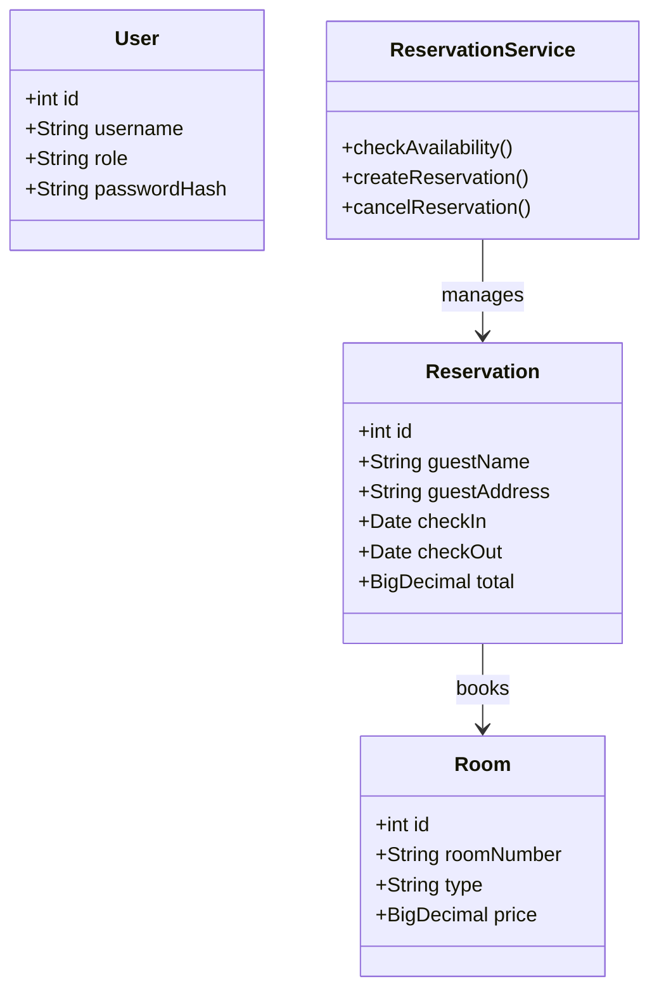
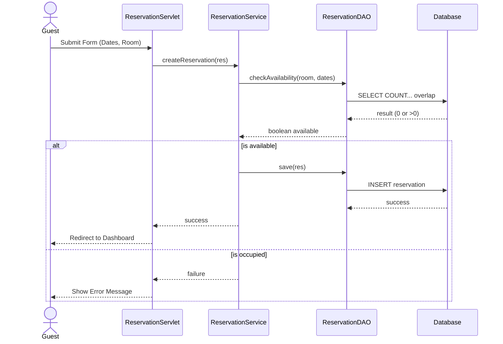
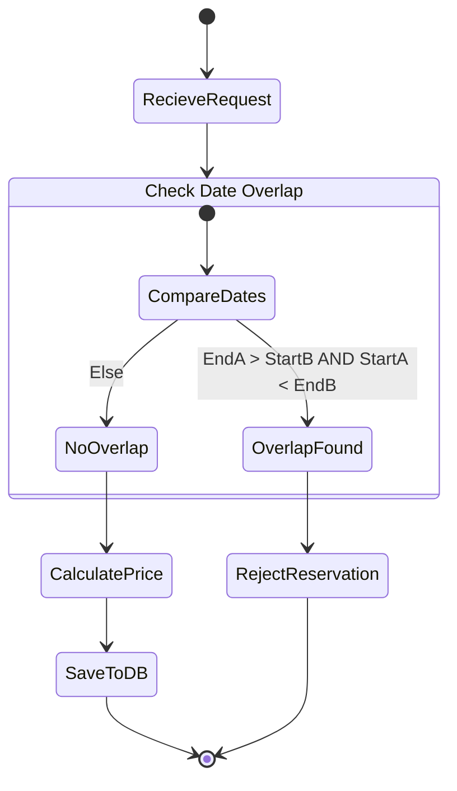

# UML Design Diagrams

## 1. Class Diagram
Visualizes the static structure of the system's core models and services.

## 2. Sequence Diagram: Reservation Creation with Overbooking Check
Visualizes the flow of creating a reservation and checking availability.

## 3. Activity Diagram: Overbooking Prevention Logic
Visualizes the decision logic for validating a reservation.

